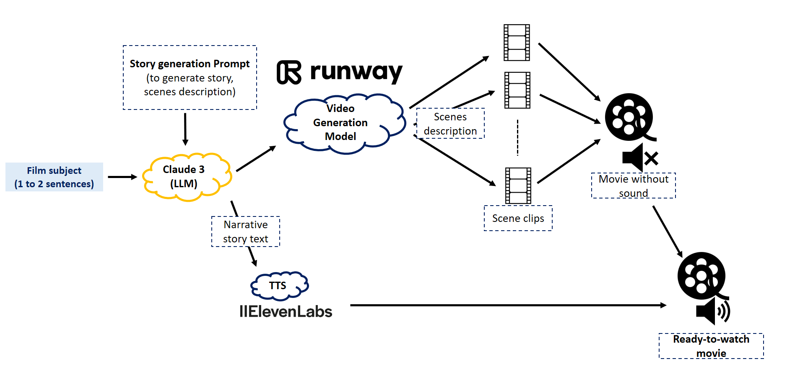

# Movies Made By AI

1. **[Movies Made By AI](https://www.moviesmadebyai.com/)** : Check out Movies Made By AI website.

2. **[Movies Made By AI Youtube Channel](https://www.youtube.com/@moviesmadebyai)** : Discover the captivating creations of our AI-powered filmmaking tool on our YouTube channel, "Movies Made By AI". Dive into a world of innovative storytelling and witness examples of the remarkable movies we've already produced.

## Contact :
If you have any questions or feedback, feel free to reach out to me:

- Email: [contact@moviesmadebyai.com](mailto:contact@moviesmadebyai.com)
- Email: [alabouchsalaheddine@gmail.com](mailto:alabouchsalaheddine@gmail.com)

## The pipeline :

To better understand the process behind Movies Made By AI, let's take a look at the pipeline that outlines how our AI-powered filmmaking tool operates.

## Projections : 

In the near future, advancements in video generation models are expected to lead to more realistic outputs and the ability to generate consistent long videos. As AI technology continues to evolve, we anticipate significant improvements in the quality and coherence of AI-generated videos. Stay tuned for groundbreaking developments in the field of AI-powered filmmaking!
